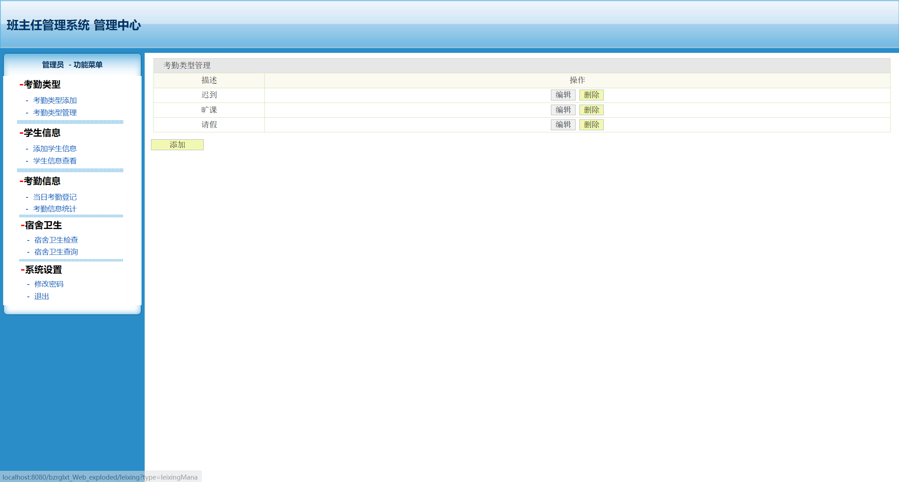
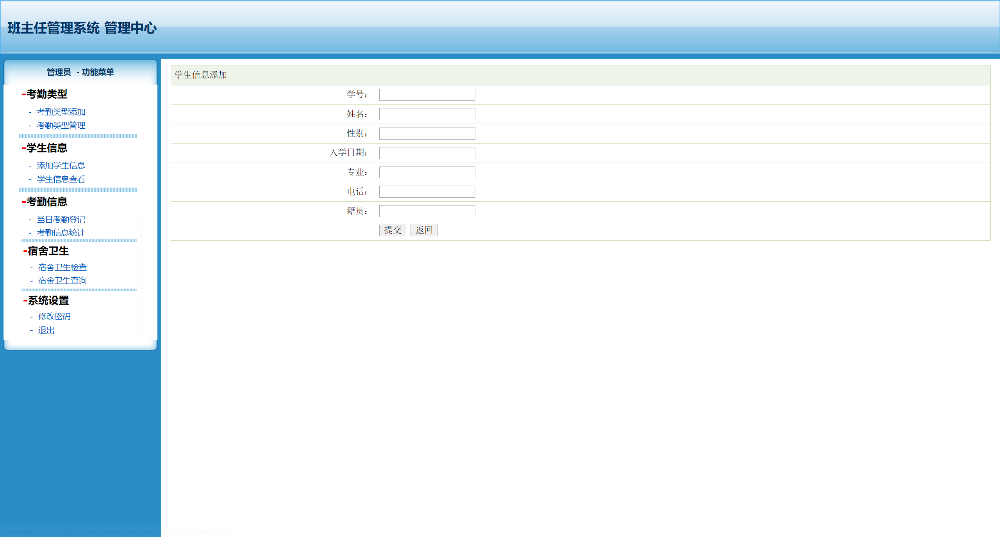
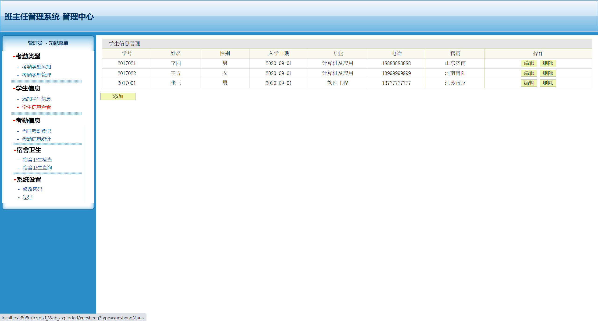
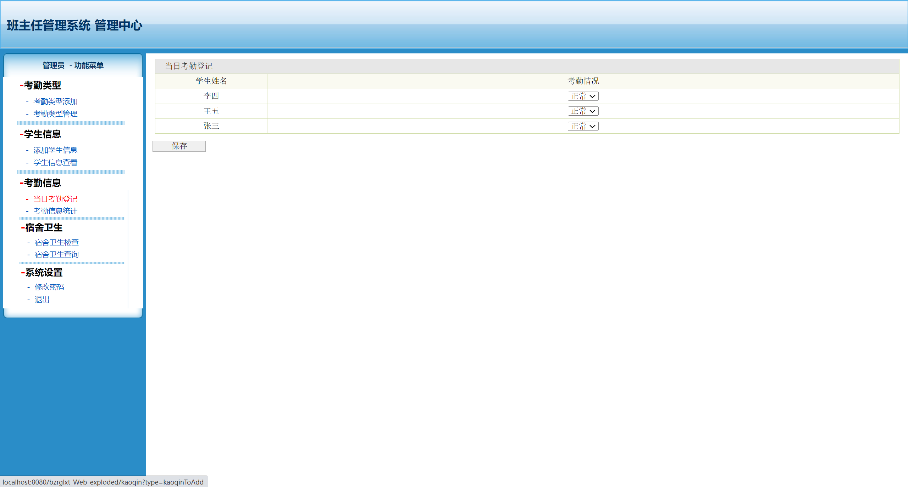

<h1 align="center">基于JSP+Servlet的班主任管理系统</h1>

 获取sql文件 QQ: 605739993 QQ群: 377586148 

 [个人站点: 从戎源码网](https://armycodes.com/)

## 简介

> 本代码来源于网络,仅供学习参考使用!
>
> 提供1.远程部署/2.修改代码/3.设计文档指导/4.框架代码讲解等服务
>
> 前端首页: http://localhost:8080/bzrglxt
>
> 管理员: admin 密码: admin
>

## 项目介绍

基于JSP+Servlet的班主任管理系统：前端 JSP、BootStrap、JQuery、Ajax，后端 Servlet，系统角色分为：管理员。本系统是一个独立的系统，用来解决班主任工作信息的管理问题。主要功能如下：

### 管理员：

- 基本操作：登录、修改密码、退出
- 考勤类型：考勤类型添加，考勤类型管理、考勤类型修改、考勤类型筛选、考勤类型删除
- 学生管理：筛选学生、添加学生信息、获取学生信息列表、查看学生信息详情、删除学生、修改学生信息
- 考勤信息：当日考勤登记，考勤信息统计
- 宿舍卫生：宿舍卫生检查，宿舍卫生查询

## 环境

- <b>IntelliJ IDEA 2020.3</b>

- <b>Mysql 5.7.26</b>

- <b>Tomcat 8.0.32</b>

- <b>JDK 1.8</b>

## 运行截图

